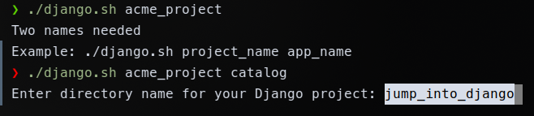
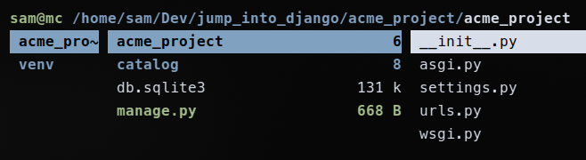
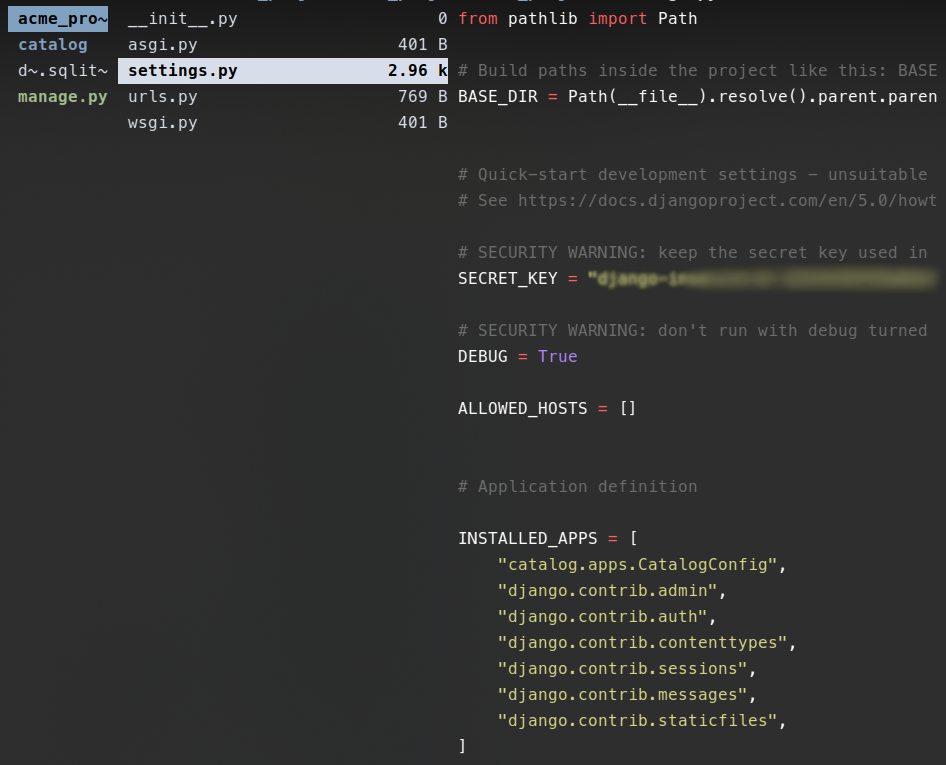
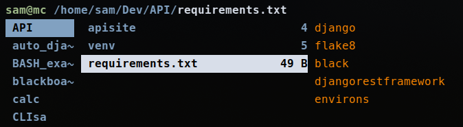
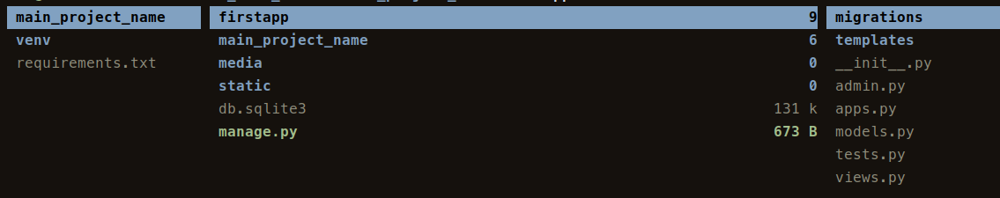
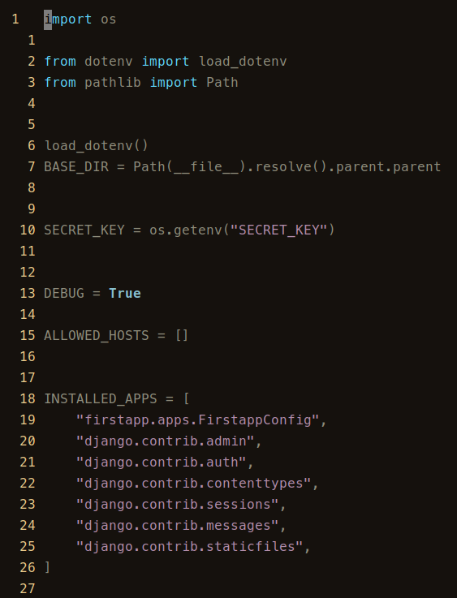

# AUTO DJANGO 
>>> django.sh shell script 

(major updates in v0️⃣.3️⃣)

## Starting up a Django project never has been easier

- **django.sh** checks for needed variables
- asks for the project folder/directory name

- creates needed folders

- does all the rest

screenshot bellow is for versions upto v0.2 (upgraded in v0.3) and above

- creates crisp requirements.txt (only used packages, without dependecies, as they will be autoinstalled anyway 😉)

## Current version v0.3

Lots of improvements.

Clean and secure settings.py.

With python-dotenv and .env variable in its due places.

Two folders are created for static and images, urls.py created for the first app.

More code-cleaning done through the script

## HOW-TO:

1. chmod +x django.sh # make it executable
1. ./django.sh name_of_your_project firstapp # do not use snake case for the firstapp yet, please
1. In a second script asks for MAIN_FOLDER_of_your_project
1. By default your project will be paced in /home/<your_username>/Dev/<MAIN_FOLDER_of_your_project>/<name_of_your_project>
1. If you need any additional apps in venv for your project, write names of the apps when asked (shoul be separated by spaces)

Current file structure v0.3

**django.sh** creates this settings.py all by itself in less than a minute

### What it does:

- **django.sh** installs virtual environment
- **django.sh** installs and upgrades pip
- **django.sh** installs flake8 and black
- **django.sh** installs python-dotenv (added in v0.3)
- **django.sh** installs additional packages of your choice (added in v0.2 of the script)
- **django.sh** creates nice and clean requirements.txt (added in v0.2 of the script)
- **django.sh** deletes all comments in settings.py and url.py (added in v0.3)
- **django.sh** edits settings.py (deletes top comments, regirsters your first app)
- **django.sh** creates media and static folders and registers them in settings.py (added in v0.3)
- **django.sh** runs all migrations and finally
- **django.sh** starts developer web-server of you Django project

## Enjoy!

- feel free to modify this script and tailor to your needs.
- consider giving it a star, if you like it 🙂

As one rather famous Belorussian chessplayer says:

"Вот теперь точно -- лайк, подписочка и даже колокольчик!" 🔔
